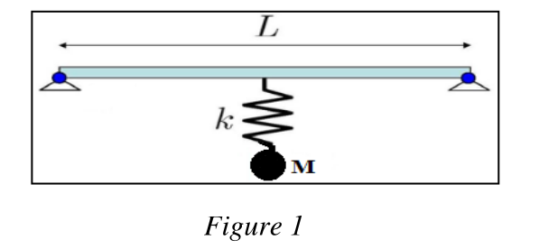

# Exercice 2

Déterminer la fréquence propre d'une masse M suspendue à une structure. La rigidité de flexion de la structure est EI et sa longueur vaut L. Elle est supposée sans masse. (Figure 1)

**Cas : Structure sur appuis simples.**

