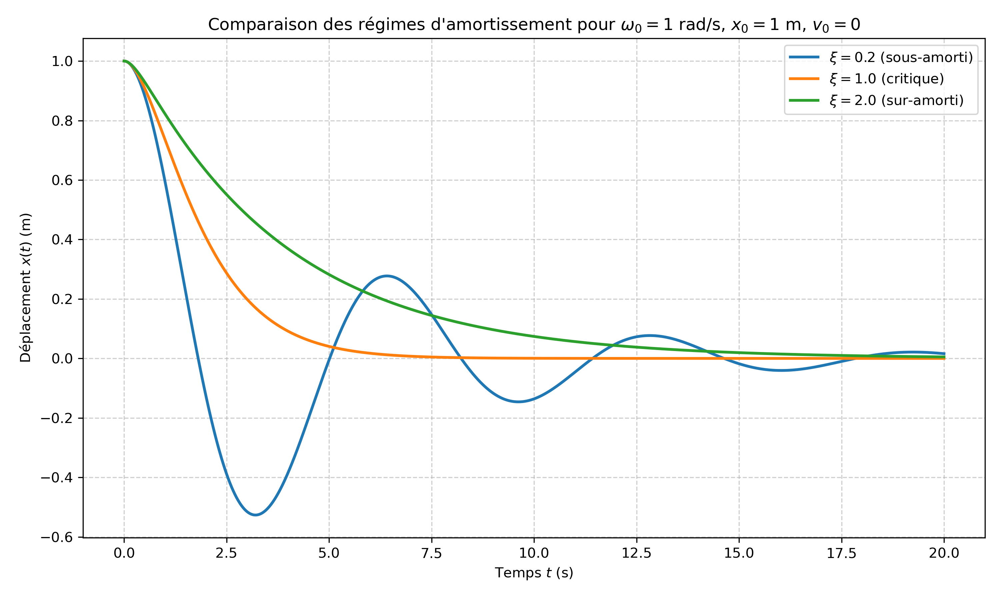

# Exercice 1 : Vibrations libres amorties d’un système à un degré de liberté

## 1. Mise en équation et paramètres caractéristiques

On considère un système mécanique élémentaire constitué d’une masse $m$, d’un ressort de raideur $k$ et d’un amortisseur visqueux de coefficient $c$. Le déplacement de la masse, repéré par rapport à sa position d’équilibre statique, est noté $x(t)$.

L’équation différentielle du mouvement, obtenue par application du principe fondamental de la dynamique, s’écrit :

$$ \begin m \ddot{x} \\ + c \dot{x} \\ + k x = 0 \end{aligned} \tag{1} $$

On introduit la pulsation propre non amortie $\omega_0 = \sqrt{k / m}$ et le facteur d’amortissement réduit $\xi = c / (2 m \omega_0)$. L’équation (1) se réduit alors à la forme canonique :

$$ \ddot{x} + 2 \xi \omega_0 \dot{x} + \omega_0^2 x = 0 \tag{2} $$

Le paramètre $\xi$ est adimensionnel. Sa valeur détermine la nature du régime vibratoire. On distingue :

- $0 < \xi < 1$ : régime sous-amorti (oscillations amorties) ;
- $\xi = 1$ : régime critique (retour le plus rapide sans oscillation) ;
- $\xi > 1$ : régime sur-amorti (retour apériodique, plus lent).

---

## 2. Résolution par l’équation caractéristique

La solution de l’équation (2) est de la forme $x(t) = e^{r t}$. En substituant cette expression dans (2), on obtient l’équation caractéristique :

$$ r^2 + 2 \xi \omega_0 r + \omega_0^2 = 0 \tag{3} $$

Le discriminant de cette équation du second degré est :

$$ \Delta = 4 \omega_0^2 (\xi^2 - 1) \tag{4} $$

Les racines sont données par :

$$ r_{1,2} = -\xi \omega_0 \pm \omega_0 \sqrt{\xi^2 - 1} \tag{5} $$

La nature de ces racines (réelles distinctes, réelle double ou complexes conjuguées) dépend du signe de $\xi^2 - 1$. Les cas $\xi = 1$ et $\xi > 1$ font l’objet des sections suivantes.

---

## 3. Régime critique ($\xi = 1$)

### 3.1. Racines et forme de la solution

Pour $\xi = 1$, l’équation (3) devient $(r + \omega_0)^2 = 0$. La racine est double et vaut :

$$ r_{1,2} = -\omega_0 \tag{6} $$

La solution générale de l’équation différentielle est alors :

$$ x(t) = (A + B t) e^{-\omega_0 t} \tag{7} $$

où $A$ et $B$ sont des constantes d’intégration.

### 3.2. Détermination des constantes à partir des conditions initiales

La condition initiale sur le déplacement, $x(0) = x_0$, donne :

$$ A = x_0 \tag{8} $$

La vitesse s’obtient en dérivant (7) :

$$ \dot{x}(t) = B e^{-\omega_0 t} - \omega_0 (A + B t) e^{-\omega_0 t} = e^{-\omega_0 t} \bigl[ B - \omega_0 (A + B t) \bigr] \tag{9} $$

En évaluant (9) à $t = 0$ et en utilisant $\dot{x}(0) = \dot{x}_0$, on obtient :

$$ \dot{x}_0 = B - \omega_0 A \quad \Longrightarrow \quad B = \dot{x}_0 + \omega_0 x_0 \tag{10} $$

### 3.3. Expression finale

En reportant (8) et (10) dans (7), on trouve :

$$ x(t) = \bigl( x_0 + (\dot{x}_0 + \omega_0 x_0) t \bigr) e^{-\omega_0 t} $$

soit, après réorganisation :

$$ \boxed{ x(t) = e^{-\omega_0 t} \bigl[ x_0 (1 + \omega_0 t) + \dot{x}_0 t \bigr] } \tag{11} $$

> **Interprétation physique** : Le terme exponentiel assure une décroissance rapide vers zéro. Le facteur $(1 + \omega_0 t)$ est la signature de la racine double ; il traduit le fait que le système revient à l’équilibre sans oscillation, et ce, plus rapidement que dans tout autre régime d’amortissement.

---

## 4. Régime sur-amorti ($\xi > 1$)

### 4.1. Racines et introduction de $\omega_d$

Pour $\xi > 1$, le discriminant (4) est strictement positif. Les deux racines sont réelles et distinctes. On définit :

$$ \omega_d = \omega_0 \sqrt{\xi^2 - 1} > 0 \tag{12} $$

Les racines (5) s’écrivent alors :

$$ r_1 = -\xi \omega_0 + \omega_d \quad \text{et} \quad r_2 = -\xi \omega_0 - \omega_d \tag{13} $$

Ces deux racines sont strictement négatives car $\xi \omega_0 > \omega_d$. La solution générale est donc :

$$ x(t) = C_1 e^{r_1 t} + C_2 e^{r_2 t} = e^{-\xi \omega_0 t} \left( C_1 e^{\omega_d t} + C_2 e^{-\omega_d t} \right) \tag{14} $$

### 4.2. Réécriture à l’aide des fonctions hyperboliques

Pour faciliter l’application des conditions initiales et l’interprétation physique, on exprime la combinaison d’exponentielles à l’aide des fonctions hyperboliques définies par :

$$ \cosh u = \frac{e^u + e^{-u}}{2} \quad \text{et} \quad \sinh u = \frac{e^u - e^{-u}}{2} \tag{15} $$

La solution (14) se réécrit :

$$ x(t) = e^{-\xi \omega_0 t} \bigl( A \cosh(\omega_d t) + B \sinh(\omega_d t) \bigr) \tag{16} $$

Les constantes $A$ et $B$ sont liées à $C_1$ et $C_2$ par $A = C_1 + C_2$ et $B = C_1 - C_2$.

### 4.3. Détermination des constantes

La condition initiale $x(0) = x_0$ donne, en évaluant (16) en $t = 0$ :

$$ A = x_0 \tag{17} $$

La vitesse s’obtient en dérivant (16) par rapport au temps :

$$ \dot{x}(t) = e^{-\xi \omega_0 t} \Bigl[ (-\xi \omega_0 A + \omega_d B) \cosh(\omega_d t) + (-\xi \omega_0 B + \omega_d A) \sinh(\omega_d t) \Bigr] \tag{18} $$

En évaluant (18) en $t = 0$, on a :

$$ \dot{x}_0 = -\xi \omega_0 A + \omega_d B \tag{19} $$

En substituant $A = x_0$ dans (19), on obtient :

$$ B = \frac{\dot{x}_0 + \xi \omega_0 x_0}{\omega_d} \tag{20} $$

### 4.4. Expression finale

En reportant (17) et (20) dans (16), on obtient la solution pour le régime sur-amorti :

$$ \boxed{ x(t) = e^{-\xi \omega_0 t} \left[ x_0 \cosh(\omega_d t) + \frac{\dot{x}_0 + \xi \omega_0 x_0}{\omega_d} \sinh(\omega_d t) \right] } \tag{21} $$

avec $\omega_d = \omega_0 \sqrt{\xi^2 - 1}$.

> **Remarque importante** : La pulsation $\omega_d$ définie en (12) est une grandeur réelle positive pour $\xi > 1$. Elle ne doit pas être confondue avec la pseudo-pulsation du régime sous-amorti ($\omega_d = \omega_0 \sqrt{1 - \xi^2}$), qui est réelle uniquement pour $\xi < 1$.

---

## 5. Commentaires physiques et cas particuliers

### 5.1. Comparaison des régimes

- Dans le régime critique, la solution (11) décroît vers zéro sans oscillation, et le facteur $t e^{-\omega_0 t}$ assure un retour à l’équilibre plus rapide que pour tout $\xi > 1$.
- Dans le régime sur-amorti, la solution (21) est une combinaison de deux exponentielles décroissantes. Le terme dominant à long terme est $e^{r_1 t} = e^{(-\xi \omega_0 + \omega_d) t}$. Lorsque $\xi$ augmente, $\omega_d \to \xi \omega_0$ et l’exposant tend vers $0$ ; le retour à l’équilibre devient donc de plus en plus lent. Un amortissement excessif ralentit paradoxalement la réponse du système.

### 5.2. Cas particuliers notables

- **Déplacement initial non nul, vitesse initiale nulle** ($\dot{x}_0 = 0$) :

$$ x_{\text{crit}}(t) = x_0 (1 + \omega_0 t) e^{-\omega_0 t} $$

$$ x_{\text{sur}}(t) = x_0 e^{-\xi \omega_0 t} \left[ \cosh(\omega_d t) + \frac{\xi \omega_0}{\omega_d} \sinh(\omega_d t) \right] $$

- **Déplacement initial nul, vitesse initiale non nulle** ($x_0 = 0$) :

$$ x_{\text{crit}}(t) = \dot{x}_0 t e^{-\omega_0 t} $$

$$ x_{\text{sur}}(t) = \frac{\dot{x}_0}{\omega_d} e^{-\xi \omega_0 t} \sinh(\omega_d t) $$

### 5.3. Lien entre les formes exponentielle et hyperbolique

La forme hyperbolique (21) est strictement équivalente à la forme exponentielle (14). En développant les fonctions hyperboliques, on retrouve :

$$ x(t) = \frac{1}{2} \left( x_0 + \frac{\dot{x}_0 + \xi \omega_0 x_0}{\omega_d} \right) e^{(-\xi \omega_0 + \omega_d) t} + \frac{1}{2} \left( x_0 - \frac{\dot{x}_0 + \xi \omega_0 x_0}{\omega_d} \right) e^{(-\xi \omega_0 - \omega_d) t} $$

Cette écriture explicite les deux modes de décroissance.

---

## 6. Représentations graphiques

Deux figures sont proposées pour illustrer les résultats :

- **Figure 1** : Évolution temporelle du déplacement $x(t)$ pour les trois régimes (sous-amorti, critique et sur-amorti) avec $x_0 = 1$ m, $\dot{x}_0 = 0$ et $\omega_0 = 1$ rad/s.

  

  <em>Figure 1 : Évolution temporelle du déplacement pour les trois régimes d’amortissement.</em>

---

## 7. Synthèse des résultats

| Régime | Valeur de $\xi$ | Racines | Solution $x(t)$ | Comportement |
|--------|-----------------|---------|-----------------|--------------|
| Sous-amorti | $0 < \xi < 1$ | $-\xi \omega_0 \pm i \omega_0 \sqrt{1-\xi^2}$ | $e^{-\xi \omega_0 t} \left[ x_0 \cos(\omega_d t) + \frac{\dot{x}_0 + \xi \omega_0 x_0}{\omega_d} \sin(\omega_d t) \right]$, $\omega_d = \omega_0 \sqrt{1-\xi^2}$ | Oscillations amorties |
| Critique | $\xi = 1$ | $-\omega_0$ (double) | $e^{-\omega_0 t} [ x_0 (1 + \omega_0 t) + \dot{x}_0 t ]$ | Retour le plus rapide sans oscillation |
| Sur-amorti | $\xi > 1$ | $-\xi \omega_0 \pm \omega_0 \sqrt{\xi^2 - 1}$ | $e^{-\xi \omega_0 t} \left[ x_0 \cosh(\omega_d t) + \frac{\dot{x}_0 + \xi \omega_0 x_0}{\omega_d} \sinh(\omega_d t) \right]$, $\omega_d = \omega_0 \sqrt{\xi^2 - 1}$ | Retour sans oscillation, plus lent que le critique |

---

